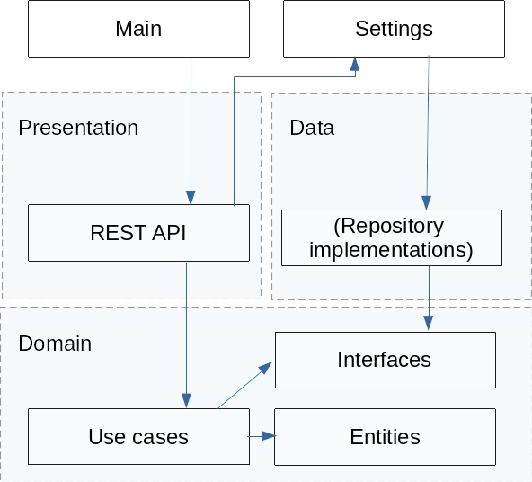

# Domain-Driven Architecture in Go

This is a simple project demonstrating a clean domain-driven architecture in Go. The domain itself has no dependencies

The architecture is similar to the Clean Architecture but with one outer layer instead of two. Of course in a large app with a lot of presentation options, interfacing with many databases, caching services and data sources, this would get split into two layers, but as a proof of concept of a clean architecture with inversion of control in Go this is not necessary.

## Dependencies graph

The dependencies look like this:



## API

The rest of the Readme describes the API:

### GET /status

Indicate the service has started up correctly and is ready to accept requests.

Responses:

* **200 OK** When the service is ready to receive requests.

### PUT /cars

Load the list of available cars in the service and remove all previous data
(existing journeys and cars). This method may be called more than once during 
the life cycle of the service.

**Body** _required_ The list of cars to load.

**Content Type** `application/json`

Sample:

```json
[
  {
    "id": 1,
    "seats": 4
  },
  {
    "id": 2,
    "seats": 6
  }
]
```

Responses:

* **200 OK** When the list is registered correctly.
* **400 Bad Request** When there is a failure in the request format, expected
  headers, or the payload can't be unmarshalled.

### POST /journey

A group of people requests to perform a journey.

**Body** _required_ The group of people that wants to perform the journey

**Content Type** `application/json`

Sample:

```json
{
  "id": 1,
  "people": 4
}
```

Responses:

* **200 OK** or **202 Accepted** When the group is registered correctly
* **400 Bad Request** When there is a failure in the request format or the
  payload can't be unmarshalled.

### POST /dropoff

A group of people requests to be dropped off. Whether they traveled or not.

**Body** _required_ A form with the group ID, such that `ID=X`

**Content Type** `application/x-www-form-urlencoded`

Responses:

* **200 OK** or **204 No Content** When the group is unregistered correctly.
* **404 Not Found** When the group is not to be found.
* **400 Bad Request** When there is a failure in the request format or the
  payload can't be unmarshalled.

### POST /locate

Given a group ID such that `ID=X`, return the car the group is traveling
with, or no car if they are still waiting to be served.

**Body** _required_ A url encoded form with the group ID such that `ID=X`

**Content Type** `application/x-www-form-urlencoded`

**Accept** `application/json`

Responses:

* **200 OK** With the car as the payload when the group is assigned to a car.
* **204 No Content** When the group is waiting to be assigned to a car.
* **404 Not Found** When the group is not to be found.
* **400 Bad Request** When there is a failure in the request format or the
  payload can't be unmarshalled.
