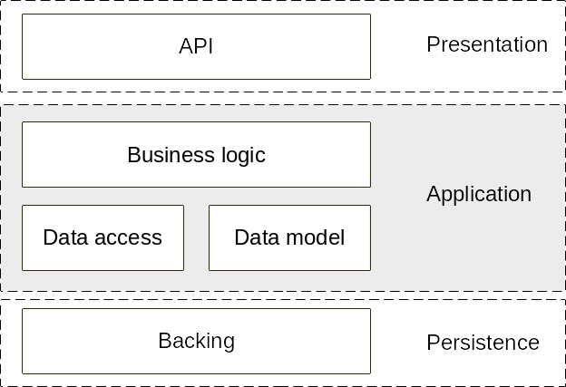

The goal of this short text is to explain some of my design ideas.

## Documentation

This project is documented using Go documentation conventions. To access it, make sure the project is in the `$GOPATH`, and run `godoc -http=localhost:<some port>`, where some port is a port of your liking. Then open a browser an open that localhost address, navigate to Third Party packages and open the project. Naming conventions are straight from the _Clean Code_ book, so in some cases I haven't documented the functions (if it's very obvious what it does by the name and signature).

## Code structure and organization

{width=50%}

The design achieves a clean architecture with separation of concerns through a classic layered approach (illustrated in Fig. 1). The layers are as follows:

* The \texttt{main} layer is the entry point of the application and wraps the other layers.
* The \texttt{api} layer contains the handlers for the api endpoints. Because both the api and business logic in this case are very simple (just a few lines per handler), I have chosen to keep them coupled under the same package. A larger API with more endpoints or more sophisticated business logic would justify splitting this layer into two (api & business layers).
* The \texttt{models} layer contains data models and their methods.
* The \texttt{data} layer provides an interface which is consumed by the \texttt{api} layer. It is best practice to segregate data access operations and business logic for several well-known reasons (data operations are bug-prone and benefit from extensive unit testing, business logic changes more often than data access procedures, etc.)
* The \texttt{backing} layer simulates a queue-based backing system such as Redis or RabbitMQ. An important part of designing cloud-native applications is that processes should be stateless (e.g. Factor 6 of the 12-Factor App). The Readme file is clear on the preference for this project to be self-contained, so I am just rolling my own queue-based backing service as its own layer. 

## Time complexity of the match procedure

{width=50%}

The backing layer is a very efficient queue that can easily handle Cabify-scale levels of users. It contains a single data structure, which I have named  \texttt{HashQueue}, owing to the fact that it is both a queue and a hashmap, which is designed to index objects with a size and an id. It wraps both an array of queues (\texttt{BySize}) and a hashmap (\texttt{ById}) (see Fig. 2 for an illustration). It is basically the same as a LRU cache but with an array of queues instead of a single one. The following operations are supported in constant time:

- Create / Read / Update / Delete an object.
- Change the size of an object.
- Find the oldest or newest element of a certain size.
- Find the oldest or newest object with size within a certain interval.

This structure is then specialized into a \texttt{CarQueue} and a \texttt{JourneyQueue} in the \texttt{data} layer. The \texttt{Match} procedure can then match journeys to cars in $O(m)$ time, where $m$ is the number of feasible journeys (according to the instructions in the Readme, a journey is feasible is it can both fit in an available car and there isn't an older journey which could fit in a car).
 
## Concurrency and Scalability

As this is an exercise, I have kept a Match call after users are added or deleted from the service. However in a production setting the match queue should run asynchronously to the API handlers to both prevent race conditions and improve latency. This is simple enough to do in Go with mutexes on the critical sections (i.e. individual elements being matched or deleted). 
